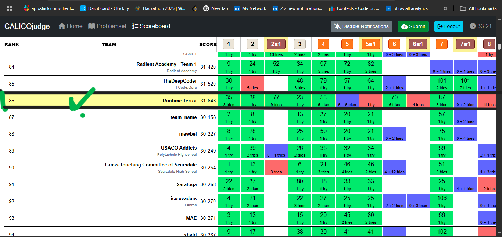

# 🏆 UC Berkeley CALICO Spring Coding Competition 2025

## 🚀 Participated in CALICO Spring 2025 Global Coding Challenge!

Welcome to the official documentation of my participation in the prestigious **[UC Berkeley CALICO Spring Coding Competition 2025](https://github.com/codewithEshaYoutube/UC_Berkley_CALICO_Spring-25/)**!

🔗 [View My LinkedIn Post](https://www.linkedin.com/posts/esha-tariqdev_ucberkeley-calicospring2025-globalcodingchallenge-activity-7322124227514368001-HKew?utm_source=share&utm_medium=member_desktop&rcm=ACoAAET0-qIBzXPQjrQe2J3E9xTPuf6cEQ71D3w)

---

## 📸 Highlights

| | |
|:---|:---|
|  | *Official Competition Poster* |
| .png) | *Live Competition Dashboard* |
|  | *Our Global Scoreboard Position* |
|  | *Our Team Collaboration Snapshot* |

---

## 🎯 About CALICO Spring 2025

**CALICO** is a globally recognized coding competition organized by **UC Berkeley**, sponsored by:
- **AlgoVerse AI Research**
- **MIT IT**
- **Berkeley Engineering**

This competition brings together top coders from universities like the **University of New York**, **Tsinghua University (China)**, **University of the Philippines**, **Russia**, and many others.  
The problems were carefully designed to be **AI/LLM-proof**, requiring pure human intelligence and problem-solving skills!

---

## 🏆 Our Achievements

- **Team Name:** Runtime Terror
- **Ranking:** **86th Worldwide** 🌍✨
- **Solved Problems:** ✅ 7 hard and tricky problems
- **Competition Duration:** 🕓 3 intense and thrilling hours
- **Collaboration:** We connected via Google Meet at **4:20 AM PKT** for live strategy and coding!

---

## 🛠️ Problems We Solved

| Problem Name | Type | Status |
|--------------|------|--------|
| `doubleit_final_main` | Algorithms | ✅ Solved |
| `pokerogue_final_main` | Dynamic Programming | ✅ Solved |
| `draft_cylinder_main` | Math/Geometry | ✅ Solved |
| `soloq_final_main` | Graph Theory | ✅ Solved |
| `circle_final_main` | Geometry | ✅ Solved |
| `tournament_final_main` | Simulation | ✅ Solved |
| `unlockmanifolds_final_main` | Combinatorics | ✅ Solved |

### ✨ Fun Facts:
- I attempted **11 times** before finally solving a particularly tricky problem!

---

## 🧠 Key Learning Outcomes

- Mastered solving dynamic programming and graph-based problems under real-world contest pressure
- Strengthened quick thinking and error-debugging strategies
- Experienced intense teamwork and live collaboration under time constraints
- Gained insights into designing **AI-proof** algorithmic solutions

---

---

## 🧑‍🤝‍🧑 Meet Our Team

- 👨‍💻 [Muhammad Sami](https://www.linkedin.com/in/muhamadsami/)
- 👩‍💻 [Afsheen Ghuman](https://www.linkedin.com/in/afsheenghuman/)
- 👩‍💻 [Eesha Tariq](https://www.linkedin.com/in/esha-tariqdev/)

---

# 🌟 A journey to remember — proud of our performance and hungry for even bigger challenges ahead!

